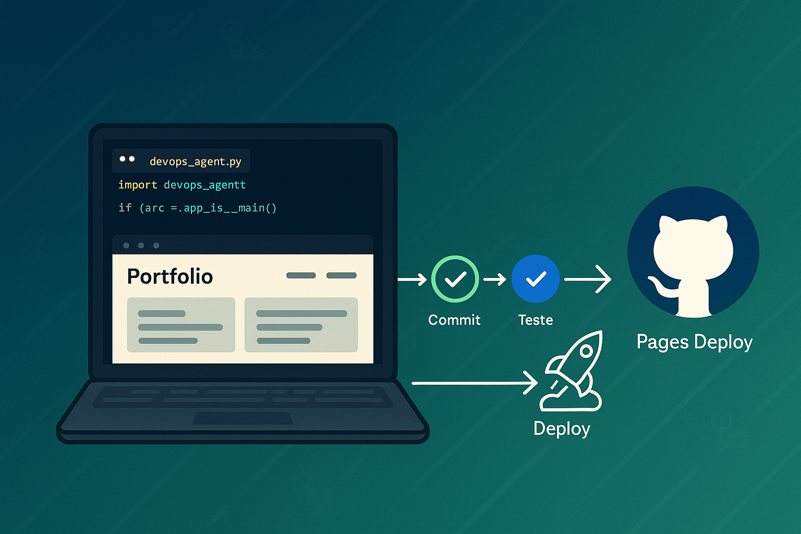
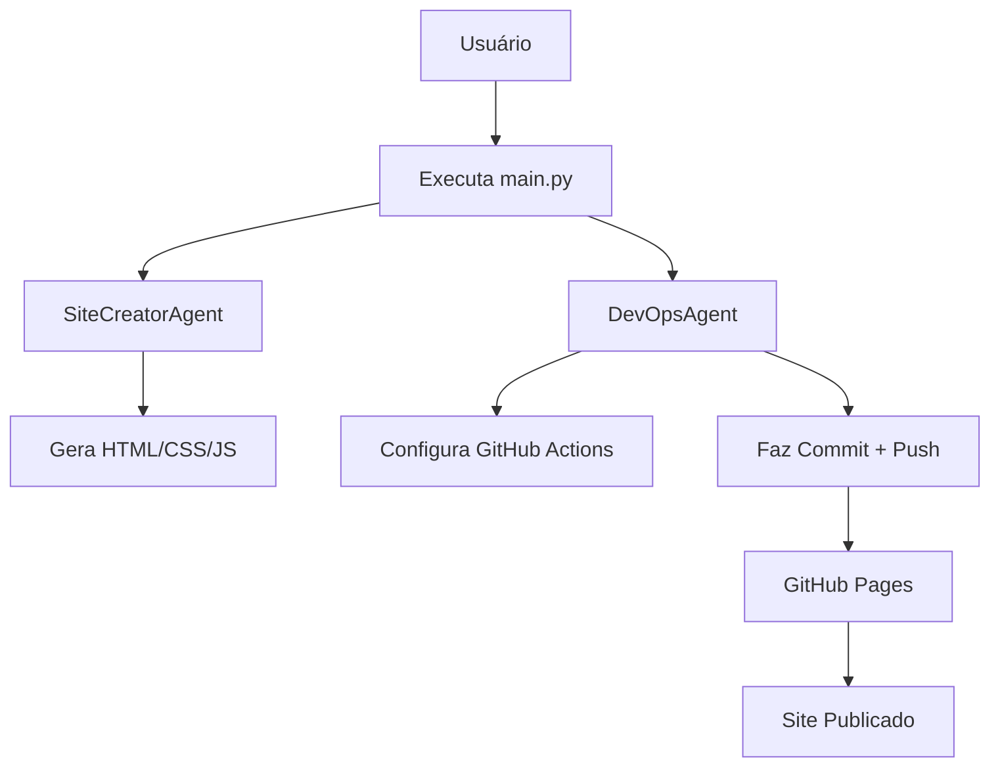

# 🚀 Portfólio Automatizado com Python + IA  
*Crie, Personalize e Publique Seu Portfólio em Minutos!*  

  
*Um assistente de IA cuida do código, você cuida da criatividade!*  

---

## 📌 Índice  
- [🚀 Portfólio Automatizado com Python + IA](#-portfólio-automatizado-com-python--ia)
  - [📌 Índice](#-índice)
  - [🌟 Sobre o Projeto](#-sobre-o-projeto)
  - [🎯 Funcionalidades](#-funcionalidades)
  - [🏗️ Arquitetura](#️-arquitetura)
  - [📂 Estrutura de Arquivos](#-estrutura-de-arquivos)
  - [🔑 Configuração de Chaves](#-configuração-de-chaves)
  - [🛠️ Instalação](#️-instalação)
    - [Pré-requisitos](#pré-requisitos)
    - [Clone e Configuração](#clone-e-configuração)
    - [Instale as Dependências](#instale-as-dependências)
    - [Configure o GitHub](#configure-o-github)
      - [Permissões do Workflow:](#permissões-do-workflow)
      - [GitHub Pages:](#github-pages)
  - [🚀 Como Usar](#-como-usar)
    - [Execute o Script Principal:](#execute-o-script-principal)
    - [Acesse Seu Portfólio:](#acesse-seu-portfólio)
    - [Faça Alterações e Commite:](#faça-alterações-e-commite)
  - [🤝 Contribuindo](#-contribuindo)
  - [📜 Licença](#-licença)

---

## 🌟 Sobre o Projeto  
**Automatize a criação de portfólios profissionais** usando Python, GitHub Actions e IA! Este projeto é perfeito para:  
- 🎓 **Estudantes** que querem um portfólio moderno sem codar manualmente.  
- 👩‍💻 **Devs** que desejam demonstrar habilidades em automação e DevOps.  
- 🚀 **Profissionais** buscando otimizar tempo com CI/CD e commits semânticos.  

**Tecnologias:** Python, LangChain, GitHub Actions, HTML5, CSS3, OpenAI.  

[⬆ Voltar ao Índice](#-índice)

---

## 🎯 Funcionalidades  
- ✅ **Geração Automática de Sites**  
  - HTML semântico, CSS responsivo e JS interativo.  
  - SEO integrado com meta tags e otimização para mecanismos de busca.  
- 🤖 **Automação DevOps**  
  - Deploy contínuo no GitHub Pages via GitHub Actions.  
  - Commits semânticos automatizados com mensagens inteligentes.  
- 🔧 **Personalização Fácil**  
  - Edite cores, conteúdos e adicione projetos em minutos.  
  - Suporte a temas claros/escuros via variáveis CSS.  

[⬆ Voltar ao Índice](#-índice)

---

## 🏗️ Arquitetura  


[⬆ Voltar ao Índice](#-índice)

---

## 📂 Estrutura de Arquivos

```
artigo-site-portifolio/
├── src/                   # Agentes Python
│   ├── site_creator_agent.py
│   ├── devops_agent.py
│   ├── main.py
│   └── commit.py
├── site/                  # Site gerado automáticamente
│   ├── index.html
│   ├── css/
│   └── js/
├── .github/workflows/     # Pipeline de Deploy gerado automáticamente
├── img/                   # Imagens/GIFs
├── .env-example           # Modelo de variáveis
├── requirements.txt       # Dependências
└── README.md              # Você está aqui!
```

[⬆ Voltar ao Índice](#-índice)

---

## 🔑 Configuração de Chaves

Renomeie `.env-example` para `.env` e preencha com suas credenciais:

```ini
# .env
AZURE_OPENAI_API_KEY="sua_chave"                                  # Obtenha em: https://azure.microsoft.com/
AZURE_OPENAI_ENDPOINT="https://seu-endpoint.openai.azure.com/"    # exemplo 
OPENAI_API_VERSION="2025-01-01-preview"                           # exemplo
DEPLOYMENT_NAME="gpt-4o-mini"                                     # exemplo 
GITHUB_TOKEN="ghp_sua chave"                                      # Obtenha em: https://github.com/settings/tokens
GITHUB_USERNAME="Jcnok"                                           # Seu username do GitHub
GITHUB_EMAIL="email@gmail.com"                                    # Email vinculado ao GitHub
GITHUB_REPO="artigo-site-portifolio"                              # Nome do repositório
```

[⬆ Voltar ao Índice](#-índice)

---

## 🛠️ Instalação

### Pré-requisitos

- Python 3.11+
- Git
- Conta no GitHub
- Conta na Azure OpenAI

### Clone e Configuração

```bash
git clone https://github.com/Jcnok/artigo-site-portifolio
cd artigo-site-portifolio

# Crie um ambiente virtual
python -m venv .venv
source .venv/bin/activate  # No Windows: .venv\Scripts\activate
```
### Instale as Dependências

```bash
pip install -r requirements.txt
```
### Configure o GitHub

#### Permissões do Workflow:

Acesse:
`https://github.com/seu-usuario/artigo-site-portifolio/settings/actions`
→ Workflow Permissions → Marque **Read and write permissions**.

#### GitHub Pages:

Vá em:
`https://github.com/seu-usuario/artigo-site-portifolio/settings/pages`
→ Branch: **gh-pages** → Pasta: `/` (root).

[⬆ Voltar ao Índice](#-índice)

---

## 🚀 Como Usar

### Execute o Script Principal:

```bash
python src/main.py
```
Isso gera o site, configura o CI/CD e publica automaticamente!

### Acesse Seu Portfólio:

Disponível em:
`https://seu-usuario.github.io/artigo-site-portifolio/`

### Faça Alterações e Commite:

```bash
python src/commit.py  # Detecta mudanças e commita com mensagem semântica!
```

[⬆ Voltar ao Índice](#-índice)

---

## 🤝 Contribuindo

1. Faça um Fork do projeto.
2. Crie uma Branch:

```bash
git checkout -b feat/minha-feature
```

3. Commita suas Mudanças:

```bash
python src/commit.py  # Ou use commits convencionais
```

4. Envie um Pull Request!

[⬆ Voltar ao Índice](#-índice)

---

## 📜 Licença

Este projeto está sob a licença MIT. Veja o arquivo [LICENSE](LICENSE) para detalhes.

Feito com 💙 por Julio Okuda | [Meu LinkedIn](https://www.linkedin.com/in/juliookuda/)
🌟 Dúvidas? Abra uma issue ou contribua para melhorar o projeto!
